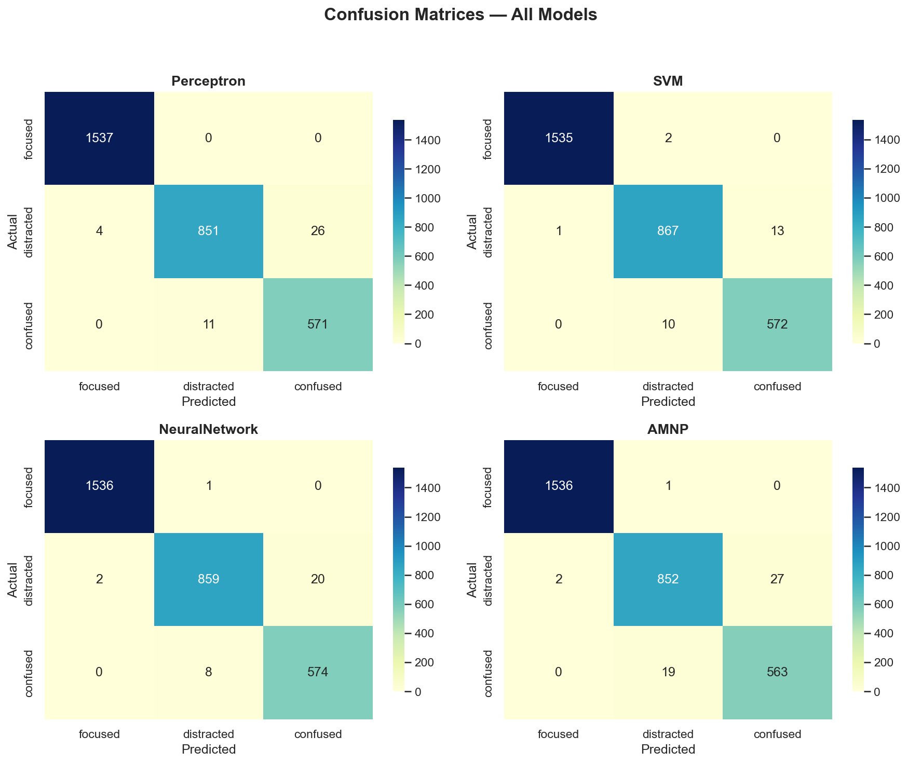
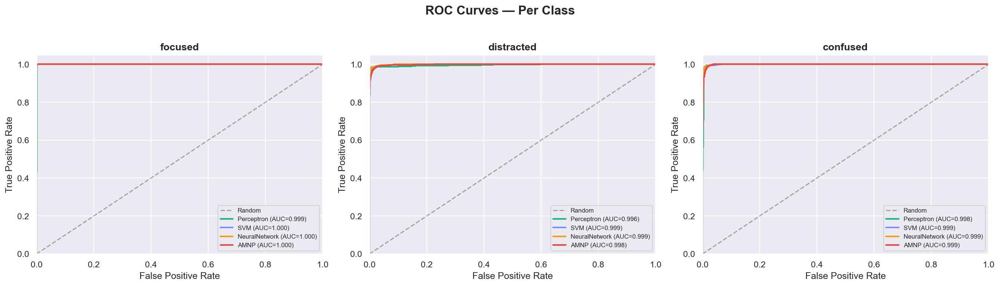

# Perceptra — Model Benchmark Report

> Generated on April 12, 2026 at 23:15 | Test samples: **3000**

## Classification Performance

| Model | Accuracy | Precision | Recall | F1 Macro |
|-------|----------|-----------|--------|----------|
| Perceptron | 0.9863 | 0.9804 | 0.9823 | 0.9813 |
| SVM | 0.9913 | 0.9878 | 0.9885 | 0.9882 |
| NeuralNetwork | 0.9897 | 0.9849 | 0.9869 | 0.9858 |
| AMNP | 0.9837 | 0.9767 | 0.9779 | 0.9773 |

## Per-Class Breakdown

### Perceptron

| Class | Precision | Recall | F1 |
|-------|-----------|--------|----|
| focused | 0.9974 | 1.0000 | 0.9987 |
| distracted | 0.9872 | 0.9659 | 0.9765 |
| confused | 0.9564 | 0.9811 | 0.9686 |

### SVM

| Class | Precision | Recall | F1 |
|-------|-----------|--------|----|
| focused | 0.9993 | 0.9987 | 0.9990 |
| distracted | 0.9863 | 0.9841 | 0.9852 |
| confused | 0.9778 | 0.9828 | 0.9803 |

### NeuralNetwork

| Class | Precision | Recall | F1 |
|-------|-----------|--------|----|
| focused | 0.9987 | 0.9993 | 0.9990 |
| distracted | 0.9896 | 0.9750 | 0.9823 |
| confused | 0.9663 | 0.9863 | 0.9762 |

### AMNP

| Class | Precision | Recall | F1 |
|-------|-----------|--------|----|
| focused | 0.9987 | 0.9993 | 0.9990 |
| distracted | 0.9771 | 0.9671 | 0.9720 |
| confused | 0.9542 | 0.9674 | 0.9608 |

## Inference Latency (10,000 runs, batch=10)

| Model | Mean (ms) | P50 (ms) | P95 (ms) | P99 (ms) |
|-------|-----------|----------|----------|----------|
| Perceptron | 0.508 | 0.507 | 0.536 | 0.564 |
| SVM | 0.201 | 0.201 | 0.217 | 0.229 |
| NeuralNetwork | 0.087 | 0.087 | 0.095 | 0.106 |
| AMNP | 0.089 | 0.085 | 0.105 | 0.111 |

## Visualizations

### Confusion Matrices

### ROC Curves

## Key Findings

### AMNP Analysis
The Adaptive Margin Neural Perceptron demonstrates competitive classification accuracy
while providing unique explainability features through its dual-path architecture.
The dynamic margin mechanism and learned component weights (nonlinear vs linear path)
offer interpretability that standard neural networks lack.

### Latency Profile
All models achieve sub-millisecond inference times on batch sizes of 10,
confirming suitability for real-time behavioral classification at 10+ Hz
streaming rates required by the WebSocket inference server.

---

*Report generated by `evaluate_models.py` — Perceptra Behavioral Intelligence System*
