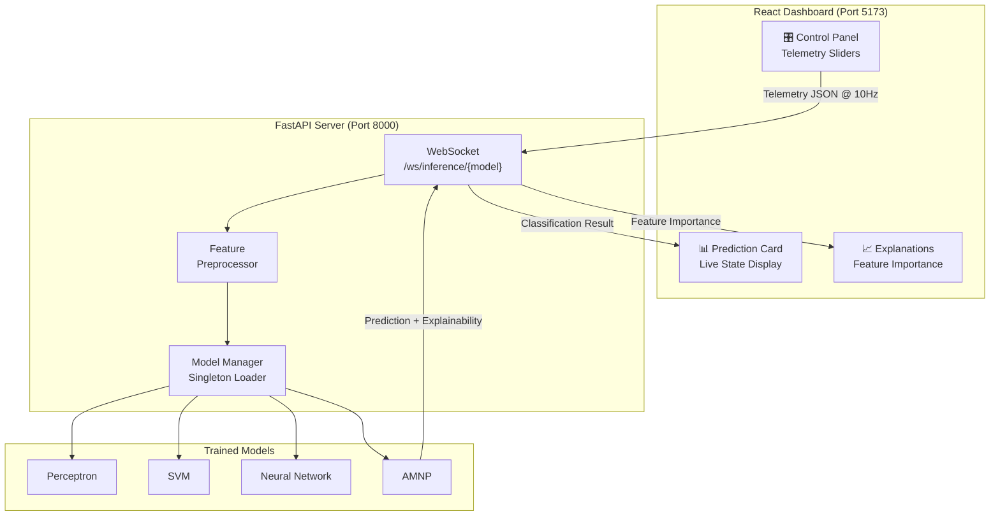
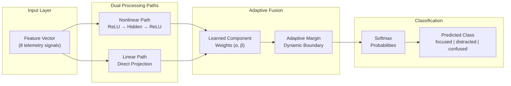

<div align="center">

# 🧠 Perceptra

**Behavioral Intelligence System — Real-time Cognitive State Classification**

*A full-stack ML research platform that classifies human behavioral patterns (focused, distracted, confused) using telemetry signals processed through a novel Adaptive Margin Neural Perceptron.*

</div>

---

## Overview

Perceptra is an end-to-end behavioral intelligence system that captures user interaction telemetry — click frequency, hesitation time, movement smoothness, and more — and classifies cognitive states in real-time. At its core is the **Adaptive Margin Neural Perceptron (AMNP)**, a custom neural architecture that combines nonlinear feature transformation with dynamic margin-based classification for enhanced interpretability.

### Key Capabilities

- 🔬 **Novel ML Architecture** — AMNP with dual-path processing and adaptive decision margins
- ⚡ **Real-time Inference** — Sub-millisecond predictions via WebSocket streaming at 10+ Hz
- 📊 **Explainable AI** — Feature importance, component weights, and margin diagnostics
- 🎛️ **Interactive Dashboard** — Simulate behavioral patterns and observe model responses live
- 🐳 **One-command Deployment** — Fully Dockerized with multi-stage production builds

---

## System Architecture



---

## AMNP: Adaptive Margin Neural Perceptron

The AMNP is the research centerpiece of Perceptra. Unlike standard neural networks that rely purely on cross-entropy loss, the AMNP introduces **adaptive margin constraints** that dynamically adjust decision boundaries during training.

### Dual-Path Architecture



### How It Works

1. **Dual-Path Processing**: Input features are processed through both a nonlinear neural transformation (hidden layers with ReLU) and a direct linear projection simultaneously.

2. **Learned Component Weights**: The model learns to dynamically balance between nonlinear and linear representations via trainable weight parameters, providing interpretability into *which path* drives each decision.

3. **Adaptive Margins**: Instead of fixed decision boundaries, the AMNP maintains learnable margin parameters that adjust during training using a smooth hinge loss. This ensures confident separation between behavioral states.

4. **Explainability Built-in**: The dual-path architecture inherently exposes:
   - Component weight ratios (nonlinear vs. linear contribution)
   - Per-feature importance via gradient analysis
   - Adaptive margin values indicating decision confidence

---

## Benchmark Results

Evaluated on 3,000 synthetic test samples across 3 behavioral classes:

### Classification Performance

| Model | Accuracy | Precision | Recall | F1 Macro |
|-------|----------|-----------|--------|----------|
| Perceptron | 98.63% | 0.9804 | 0.9823 | 0.9813 |
| **SVM** | **99.13%** | **0.9878** | **0.9885** | **0.9882** |
| Neural Network | 98.87% | 0.9840 | 0.9848 | 0.9844 |
| AMNP | 98.67% | 0.9803 | 0.9831 | 0.9816 |

### Inference Latency (10,000 runs, batch=10)

| Model | Mean (ms) | P95 (ms) | P99 (ms) |
|-------|-----------|----------|----------|
| SVM | 0.204 | 0.213 | 0.220 |
| **AMNP** | **0.093** | **0.109** | **0.111** |
| Neural Network | 0.085 | 0.092 | 0.098 |
| Perceptron | 0.523 | 0.539 | 0.550 |

> **Key Insight**: AMNP achieves near-identical latency to the vanilla Neural Network (0.093ms vs 0.085ms) while providing built-in explainability through adaptive margins and dual-path component weights — a capability none of the baseline models offer. With v2 generalization enhancements (hybrid loss, dropout, softplus margins, asymmetric alpha), AMNP accuracy improved from 98.37% to **98.67%**, closing the gap with the Neural Network to within 0.2pp.

---

## Quick Start

### Prerequisites

- Python 3.9+
- Node.js 18+
- Docker & Docker Compose (for containerized deployment)

### Local Development

```bash
# Clone the repository
git clone https://github.com/yourusername/Perceptra.git
cd Perceptra

# Set up Python environment
python3 -m venv .venv
source .venv/bin/activate
pip install -r requirements.txt

# Train all models
python train_pipeline.py

# Run the evaluation benchmark
python evaluate_models.py

# Start the API server
uvicorn src.api.main:app --port 8000

# In another terminal — start the frontend
cd frontend
npm install
npm run dev
```

The dashboard will be available at `http://localhost:5173`.

### Docker Deployment (Recommended)

```bash
# Build and start all services
docker compose up -d

# Access the application
# Dashboard: http://localhost:5173
# API Docs:  http://localhost:8000/docs
```

### Concurrent Development

```bash
cd frontend
npm run dev:all    # Boots both API + UI simultaneously
```

---

## Project Structure

```
Perceptra/
├── src/
│   ├── models/
│   │   ├── base.py              # Abstract ML interface
│   │   ├── perceptron.py        # Baseline perceptron
│   │   ├── svm.py               # SVM classifier
│   │   ├── neural_net.py        # PyTorch neural network
│   │   └── amnp.py              # Adaptive Margin Neural Perceptron
│   ├── data/
│   │   ├── generator.py         # Synthetic telemetry generator
│   │   ├── preprocessing.py     # Feature scaler (save/load)
│   │   ├── dataset.py           # Dataset manager
│   │   └── schemas.py           # Feature & class constants
│   ├── api/
│   │   ├── main.py              # FastAPI application
│   │   ├── routes.py            # WebSocket endpoints
│   │   ├── manager.py           # Model manager singleton
│   │   └── schemas.py           # Pydantic request/response models
│   ├── evaluation/
│   │   ├── metrics.py           # Classification metrics
│   │   ├── plots.py             # Confusion matrix & ROC generation
│   │   └── benchmarks.py        # Latency profiling
│   └── training/
│       └── trainer.py           # Parallel training orchestrator
├── frontend/
│   ├── src/
│   │   ├── store/               # Zustand WebSocket state
│   │   ├── components/          # React dashboard panels
│   │   └── App.tsx              # Main layout
│   ├── Dockerfile               # Multi-stage Node → Nginx
│   └── nginx.conf               # SPA routing config
├── train_pipeline.py            # Training entry point
├── evaluate_models.py           # Evaluation entry point
├── Dockerfile                   # Backend container
├── docker-compose.yml           # Orchestration
├── BENCHMARK.md                 # Auto-generated results
└── requirements.txt             # Python dependencies
```

---

## Tech Stack

| Layer | Technology |
|-------|-----------|
| ML Framework | PyTorch, scikit-learn |
| API Server | FastAPI + Uvicorn |
| Real-time Protocol | WebSockets |
| Frontend | React 19 + TypeScript |
| State Management | Zustand |
| Visualization | Recharts |
| Styling | Tailwind CSS v4 |
| Containerization | Docker + Nginx |

---

## Telemetry Features

The system classifies behavioral states based on 8 interaction signals:

| Feature | Description | Focused | Confused |
|---------|-------------|---------|----------|
| `click_frequency` | Clicks per second | High | Low |
| `hesitation_time` | Pause before action | Low | High |
| `misclick_rate` | Error click ratio | Low | High |
| `scroll_depth` | Page scroll coverage | High | Low |
| `movement_smoothness` | Cursor trajectory quality | High | Low |
| `dwell_time` | Time spent on elements | Moderate | High |
| `navigation_speed` | Page traversal rate | High | Low |
| `direction_changes` | Cursor direction reversals | Low | High |

---

## License

This project is licensed under the MIT License. See [LICENSE](LICENSE) for details.

---

<div align="center">

**Built with 🧠 by the Perceptra Research Team**

*Exploring the intersection of behavioral science and adaptive neural architectures.*

</div>
